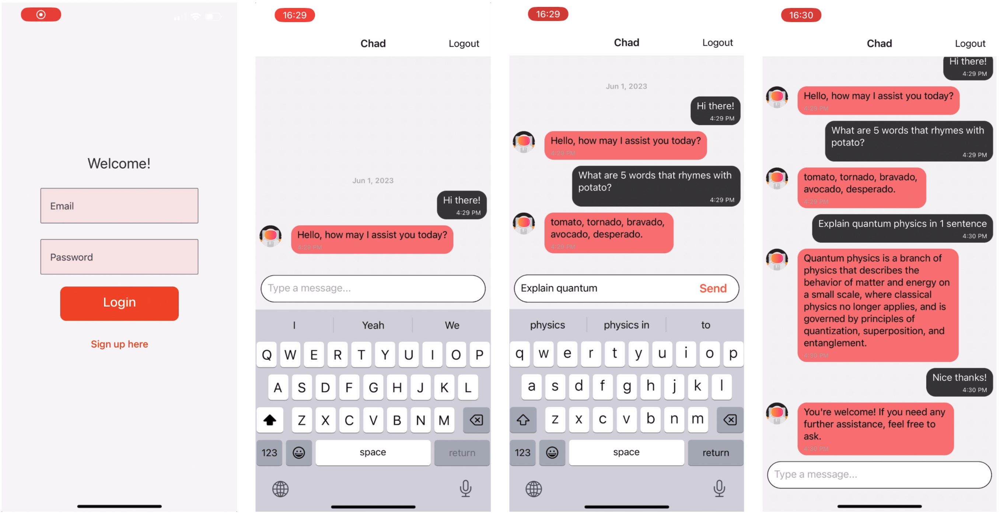

# GPT-Voice-Assistant
GPT3.5-Turbo powered speech2Text - Text2Speech Voice assistant mobile app. 
 
#### Demo: https://www.youtube.com/watch?v=7Tx1gNGcYrk&t=66s

## Design & Implementation
Design and Implementation
The app is a full stack mobile app that uses react native in the front end, firebase firestore for database, firebase cloud functions(Node.js) for backend server side logic. The app also uses 2 external APIs including GPT-3.5-Turbo for generating a response and Google’s Text-to-Speech API to generate an audio file from response. Finally the app uses the speaker native API to also give the option for the user to output the response through the user's phone speakers(Below is a better explanation).

### Future Improvements
Allow Voice assistant personalization through accessing other apps and phone metadata. 
